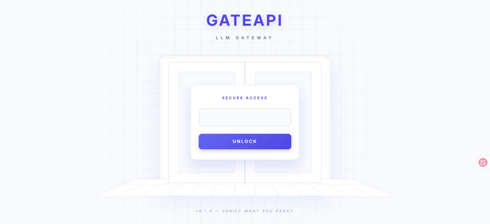
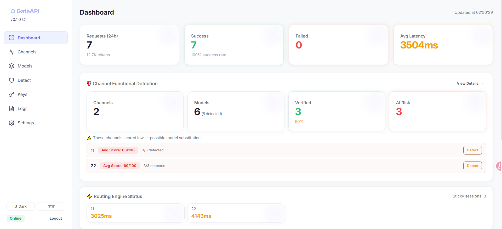
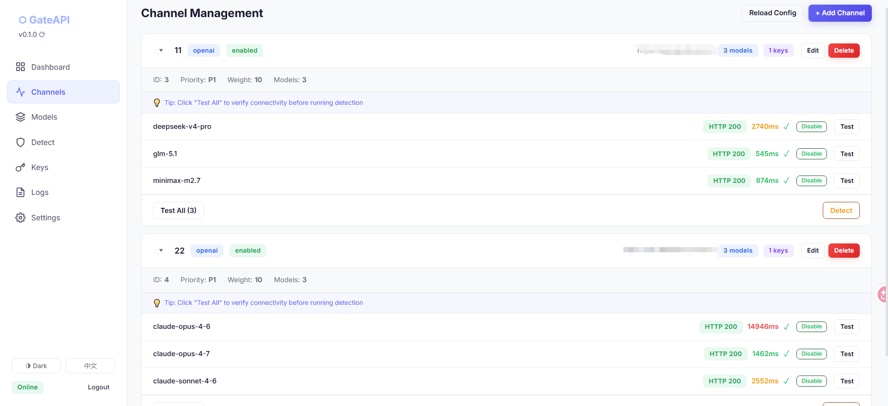
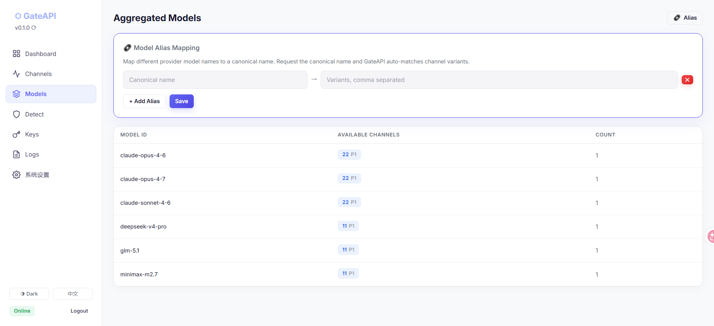
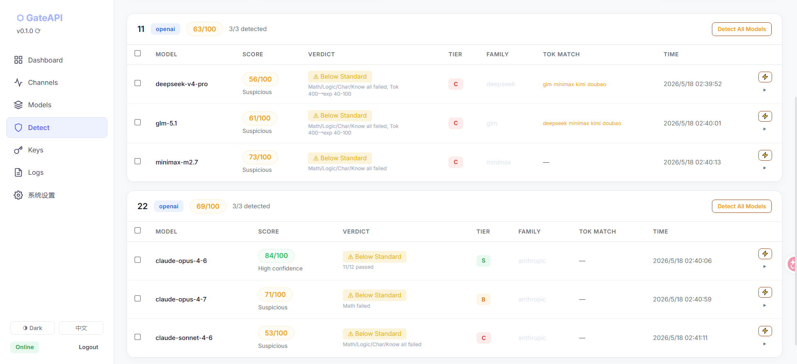
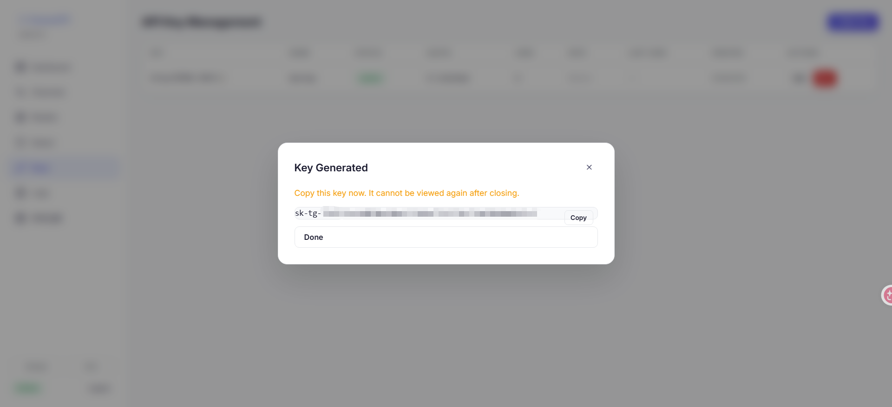
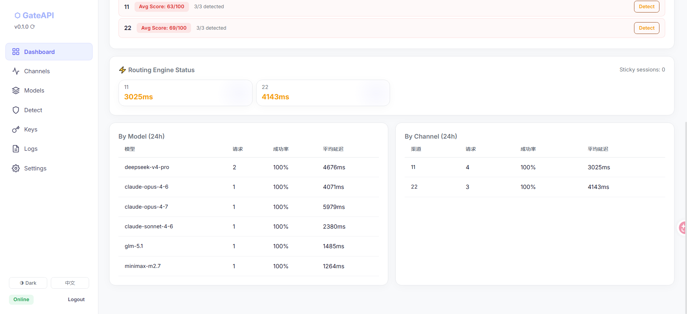
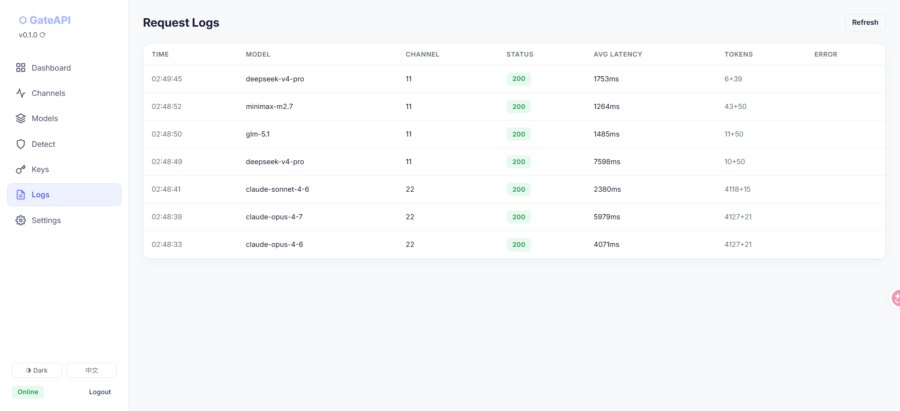

<p align="center">
  
</p>

# ⬡ GateAPI

[](https://github.com/Nasan-Duodushu/GateAPI/releases)
[](https://github.com/Nasan-Duodushu/GateAPI)
[](https://nodejs.org/)
[](LICENSE)
[](https://linux.do)

**[English](README.md)** | **中文**

**LLM API 聚合网关 + 模型功能性检测引擎**

[截图预览](#应用截图) · [快速开始](#快速开始) · [Docker 部署](#docker-部署) · [Linux 部署](#linux-服务器部署) · [检测引擎](#检测引擎) · [智能路由](#智能路由引擎) · [管理 API](#管理-api) · [更新升级](#更新升级) · [贡献指南](CONTRIBUTING.md)

如果觉得有用，欢迎点个 ⭐ Star，这是对我们最大的支持。

---

## 关于本项目

手里一堆 API 中转站的 Key，有的走 OpenAI 协议，有的走 Anthropic 协议，每家支持的模型还不一样——管理起来挺麻烦的。

GateAPI 干的事情很简单：**把所有中转站的接口聚合到一起，统一成一个标准的 API 输出**。不管上游是什么协议，下游统一用 `/v1/chat/completions` 调就行。同一个模型如果多家都有，会自动按优先级和权重分配请求，某个挂了或者慢了自动切到别的渠道，不用你操心。

除了聚合，GateAPI 还内置了一套**检测引擎**。首先是连通性检测——帮你批量测一遍所有渠道的所有模型，哪些能用哪些挂了，一目了然。然后是功能性检测——通过 13 项探针从数学能力、逻辑推理、Tokenizer 指纹等多个维度交叉验证，看看上游实际提供的模型功能表现是否正常。

> **⚠️ 注意：** 初次部署后，默认管理员密码为 `admin123`，**务必登录后立即修改！**

> **声明：** 检测结果仅供参考，不代表最终结论。受网络条件、上游状态、模型版本迭代等因素影响，结果可能有偏差。检测引擎提供的是辅助判断依据，最终请结合实际情况自行评估。

---

## 功能特性

**API 聚合网关**
- 多家提供商统一成一个 `/v1/chat/completions` 入口，下游无感切换
- OpenAI / Anthropic 双协议自动转换，不用操心格式差异
- 按优先级 + 动态权重智能路由，延迟高的自动降权，429 了自动冷却跳过
- 内置 API 密钥管理，支持配额、速率限制，发密钥给别人用也方便

**模型检测引擎**
- 连通性检测：一键批量测试所有渠道的所有模型，能不能调通、延迟多少，直接看结果
- 功能性检测：13 项探针（数学、逻辑推理、Tokenizer 指纹、响应延迟、Token 用量等），从多个维度验证模型实际功能表现
- 50+ 模型的 Tokenizer 指纹库，辅助判断模型家族归属
- 检测完自动评分，表现异常的渠道直接标红，不用自己一个个翻

**管理面板**
- 自带 Web 管理面板，不用敲命令行，浏览器里就能管渠道、看日志、跑检测
- 仪表盘实时展示请求量、成功率、延迟、检测状态
- 支持中英双语切换和深色模式
- 一键检查更新 + 在线升级

---

## 应用截图

| | |
|:---:|:---:|
|  |  |
| 登录页 | 仪表盘 |
|  |  |
| 渠道管理 | 模型聚合 |
|  |  |
| 检测引擎 | 密钥管理 |
|  |  |
| 数据统计 | 请求日志 |

---

## 系统架构

```
┌─────────────────────────────────────────────────────────────────┐
│                          GateAPI                                │
│                                                                 │
│  ┌──────────┐    ┌──────────────┐    ┌───────────────────────┐  │
│  │  Router   │───▶│  Distributor  │───▶│     Forwarder         │  │
│  │          │    │              │    │                       │  │
│  │ /v1/chat │    │ 优先级分组    │    │ HTTP 转发             │  │
│  │ /v1/msg  │    │ 动态权重     │    │ 协议转换 OAI↔Anth    │  │
│  │ /v1/mdls │    │ 粘性会话     │    │ SSE 流式透传          │  │
│  │          │    │ 429 自适应   │    │ 空内容检测 + 重试     │  │
│  └──────────┘    └──────────────┘    └───────┬───────────────┘  │
│                                              │                  │
│  ┌──────────┐    ┌──────────────┐            │                  │
│  │  Admin   │    │  Detective    │            │                  │
│  │  API     │    │  Engine       │            │                  │
│  │          │    │              │            │                  │
│  │ 渠道CRUD │    │ 13项探针     │            │                  │
│  │ 密钥管理 │    │ 指纹库50+   │            │                  │
│  │ 日志统计 │    │ 评分系统     │            │                  │
│  └──────────┘    └──────────────┘            │                  │
│                                              │                  │
│  ┌──────────┐    ┌──────────────┐            │                  │
│  │  Store   │    │  Scheduler   │            │                  │
│  │ SQLite   │    │ 定时检测     │            │                  │
│  │ 请求日志 │    │ 被动采样     │            │                  │
│  │ 检测结果 │    │ 自动降级     │            │                  │
│  └──────────┘    └──────────────┘            │                  │
└──────────────────────────────────────────────┼──────────────────┘
                                               │
                    ┌──────────────────────────────────────┐
                    │          上游 LLM 提供商              │
                    │                                      │
                    │  ┌─────────┐ ┌─────────┐ ┌────────┐ │
                    │  │ OpenAI  │ │Anthropic│ │ 中转站  │ │
                    │  │ 协议    │ │ 协议    │ │ (any)  │ │
                    │  └─────────┘ └─────────┘ └────────┘ │
                    └──────────────────────────────────────┘
```

## 请求处理流程

```
客户端请求
    │
    ▼
┌─ Router ─────────────────────────────────────────────────────┐
│  ① 认证：验证 API Key（Bearer Token）                        │
│  ② 解析：提取 model 字段                                     │
│  ③ 协议适配：Anthropic /v1/messages → 内部 OpenAI 格式       │
└──────────────────────────┬───────────────────────────────────┘
                           │
                           ▼
┌─ Distributor ────────────────────────────────────────────────┐
│  ① Sticky Session：10min 内复用上次成功渠道                  │
│  ② 优先级分组：priority 高 → 低                              │
│  ③ 动态权重随机：                                            │
│     - 基础 weight × 延迟系数（>3s 减半，>8s 降1/4）          │
│     - 429 冷却中 → 权重=0 跳过                               │
│  ④ 模型别名解析：统一映射到实际模型名                        │
└──────────────────────────┬───────────────────────────────────┘
                           │
                           ▼
┌─ Forwarder ──────────────────────────────────────────────────┐
│  ① 协议转换：OpenAI body → Anthropic body（如需）           │
│  ② HTTP 转发：POST 到上游端点                                │
│  ③ 响应处理：                                                │
│     - 流式：SSE 透传（含 Anthropic→OpenAI SSE 实时转换）     │
│     - 非流式：JSON 解析 + 空内容检测                         │
│  ④ 空内容检测：                                              │
│     - 上游返回 200 但 content=null & completion_tokens=0     │
│     - 视为错误，触发重试                                     │
│  ⑤ 重试机制：                                                │
│     - 排除失败渠道，选下一个可用渠道                         │
│     - 最多 retryTimes 次（默认2次，共3次尝试）               │
│     - 可重试状态码：429, 500, 502, 503                       │
│  ⑥ 健康追踪：连续5次失败 → 自动降级5分钟                    │
└──────────────────────────┬───────────────────────────────────┘
                           │
                           ▼
                    返回响应给客户端
```

## 检测引擎流程

```
触发检测（手动 / 定时 / 被动采样）
    │
    ▼
┌─ Batch 1/3（并行）───────────────────────────────────────────┐
│                                                              │
│  ┌─ Composite Probe ──────────┐  ┌─ TTFT Probe ──────────┐  │
│  │ 单次 API 调用提取 7 项结果  │  │ "Say hello." 测首延迟  │  │
│  │                            │  │ 提取 prompt_tokens     │  │
│  │ ① 身份自报 (Identity)      │  │ 用于 Tokenizer 交叉    │  │
│  │ ② 身份匹配 (IdentityModel) │  └────────────────────────┘  │
│  │ ③ 推理令牌 (Reasoning)     │                              │
│  │ ④ 数学能力 (Math)          │                              │
│  │ ⑤ 逻辑推理 (Logic)        │                              │
│  │ ⑥ 字符计数 (Strawberry)   │                              │
│  │ ⑦ 知识新鲜度 (Knowledge)  │                              │
│  │                            │                              │
│  │ 零成本附加：               │                              │
│  │ ⑧ 模型字段 (ModelField)   │                              │
│  │ ⑨ Token用量 (TokenUsage)  │                              │
│  └────────────────────────────┘                              │
└──────────────────────────────────────────────────────────────┘
    │
    ▼
┌─ Batch 2/3（并行）───────────────────────────────────────────┐
│  ┌─ TempConsist ──────────────┐  ┌─ LongContext ──────────┐  │
│  │ temp=0 两次调用             │  │ 多轮对话回忆           │  │
│  │ 结果一致性 ≥95%?           │  │ 随机UUID记忆回溯       │  │
│  └────────────────────────────┘  └────────────────────────┘  │
└──────────────────────────────────────────────────────────────┘
    │
    ▼
┌─ Batch 3/3（并行）───────────────────────────────────────────┐
│  ┌─ Logprobs ─────────────────┐  ┌─ Tokenizer FP ─────────┐ │
│  │ top-5 logprobs 熵分析      │  │ 52模型实测指纹库       │ │
│  │ 概率分布是否匹配该模型     │  │ CJK/Western/Ancient    │ │
│  │ (仅 OpenAI 协议可用)       │  │ 三层分类 + 家族匹配    │ │
│  └────────────────────────────┘  └────────────────────────┘ │
└──────────────────────────────────────────────────────────────┘
    │
    ▼
┌─ 评分系统 ───────────────────────────────────────────────────┐
│  加权评分 = Σ(探针得分 × 权重) / Σ(权重)                    │
│                                                              │
│  高权重探针（难以伪造）:                                     │
│    Reasoning(8) > ModelField(7) > IdentityModel(6)           │
│    > Logprobs(5) > Tokenizer(8) > Identity(4)                │
│                                                              │
│  中权重探针（能力检测）:                                     │
│    Math(3) · Logic(3) · Strawberry(3) · TempConsist(2)       │
│                                                              │
│  低权重探针（辅助信号）:                                     │
│    LongCtx(1) · TTFT(1) · Knowledge(1) · TokenUsage(2)      │
│                                                              │
│  特殊机制：                                                  │
│    - 能力等级落差 ≥2 级 → 额外扣分(w=6)                     │
│    - 家族不匹配 → verdict = family_mismatch                  │
│    - 有效探针 < 3 → verdict = insufficient                   │
└──────────────────────────────────────────────────────────────┘
    │
    ▼
  输出：得分(0-100) + 等级(S/A/B/C) + 判定(pass/weak/mismatch)
```

## 特性一览

### 核心能力
- **统一 API 入口** — 多个 LLM 提供商聚合为一个 OpenAI 兼容端点
- **双协议原生支持** — 同时提供 OpenAI (`/v1/chat/completions`) 和 Anthropic (`/v1/messages`) 端点
- **模型真实功能性检测** — 13 项探针自动鉴别模型功能真伪（身份、数学、逻辑、tokenizer 指纹等）
- **SSE 流式透传** — 完整支持流式响应，包括 Anthropic SSE → OpenAI SSE 实时转换
- **空内容检测** — 上游返回 HTTP 200 但内容为空时自动识别并触发重试

### 智能路由引擎
- **延迟感知路由** — 记录各渠道滚动平均延迟，自动优先选择更快的渠道
- **429 限流自适应** — 收到 429 后指数退避冷却（30s→5min），冷却期间自动分流
- **粘性会话缓存** — 同一用户 + 同一模型 10 分钟内复用同一渠道，减少上下文切换
- **优先级 + 动态权重** — 基础权重根据延迟和限流状态实时调整
- **自动故障转移** — 连续 5 次失败自动降级，5 分钟后自动恢复
- **多渠道重试** — 失败后自动切换到其他提供同一模型的渠道

### 模型管理
- **全局模型别名** — 将不同中转站的模型名统一映射到规范名
- **模型级别停用** — 精确停用某个渠道的某个模型，不影响同渠道其他模型
- **检测联动停用** — 检测发现问题模型自动停用（非整个渠道），全部模型问题时降级渠道

### 运维 & UI
- **管理面板** — 暗色/亮色主题 Web UI，中英双语
- **路由状态仪表盘** — 实时展示各渠道延迟、429 冷却状态、粘性会话数
- **检测健康概览** — Dashboard 显示检测通过率、风险渠道列表
- **零依赖部署** — 仅 3 个生产依赖（Express + better-sqlite3 + cors）

## 快速开始

### 1. 安装

```bash
git clone https://github.com/Nasan-Duodushu/GateAPI.git
cd gateapi
npm install
```

### 2. 配置

```bash
cp config.example.json data/config.json
```

编辑 `data/config.json`：

```json
{
  "server": {
    "port": 3000,
    "adminToken": "admin123",
    "apiKeys": ["sk-your-api-key"]
  },
  "relay": {
    "timeout": 60000,
    "retryTimes": 2,
    "retryOnStatusCodes": [429, 500, 502, 503]
  },
  "channels": [
    {
      "name": "Provider-A",
      "type": "openai",
      "endpoint": "https://api.example.com/v1",
      "keys": ["sk-upstream-key"],
      "models": ["gpt-4o", "claude-opus-4-7"],
      "weight": 10,
      "priority": 1,
      "status": "enabled"
    }
  ]
}
```

### 3. 启动

```bash
npm start
```

```
╔══════════════════════════════════════════════╗
║           GateAPI v0.1.0                     ║
║  LLM API Gateway with Authenticity Detection ║
╠══════════════════════════════════════════════╣
║  API:    http://localhost:3000/v1            ║
║  Admin:  http://localhost:3000/admin         ║
║  Panel:  http://localhost:3000/              ║
╚══════════════════════════════════════════════╝
```

访问 `http://localhost:3000` 打开管理面板，使用 `adminToken` 登录。

### 4. 使用 API

```bash
# 列出可用模型
curl http://localhost:3000/v1/models \
  -H "Authorization: Bearer sk-your-api-key"

# Chat Completions（OpenAI 协议）
curl http://localhost:3000/v1/chat/completions \
  -H "Authorization: Bearer sk-your-api-key" \
  -H "Content-Type: application/json" \
  -d '{"model":"gpt-4o","messages":[{"role":"user","content":"Hello"}]}'

# 流式响应
curl http://localhost:3000/v1/chat/completions \
  -H "Authorization: Bearer sk-your-api-key" \
  -H "Content-Type: application/json" \
  -d '{"model":"gpt-4o","messages":[{"role":"user","content":"Hello"}],"stream":true}'

# Anthropic 原生协议
curl http://localhost:3000/v1/messages \
  -H "Authorization: Bearer sk-your-api-key" \
  -H "Content-Type: application/json" \
  -d '{"model":"claude-opus-4-7","max_tokens":1024,"messages":[{"role":"user","content":"Hello"}]}'
```

## Docker 部署

```bash
docker build -t gateapi .
docker run -d -p 3000:3000 -v ./data:/app/data gateapi
```

或使用 docker-compose：

```bash
docker-compose up -d
```

## 项目结构

```
gateapi/
├── src/
│   ├── index.js              # Express 入口 + 启动 banner
│   ├── config.js             # 配置加载 + 热更新 + 模型索引
│   ├── store.js              # SQLite 存储（请求日志 + 检测结果 + API Key 管理）
│   ├── router.js             # 对外 API 路由（双协议 + 重试循环）
│   ├── scheduler.js          # 定时检测 + 被动采样 + 自动降级联动
│   ├── relay/
│   │   ├── distributor.js    # 路由引擎（优先级 + 动态权重 + 粘性会话 + 429自适应）
│   │   └── forwarder.js      # 请求转发（协议转换 + SSE透传 + 空内容检测 + 健康追踪）
│   ├── admin/
│   │   └── api.js            # 管理 API（渠道CRUD / 统计 / 检测触发 / 密钥管理）
│   └── detective/
│       ├── engine.js         # 检测引擎（13项探针 + 3批并行 + 加权评分）
│       ├── fingerprints.js   # 模型指纹库（50+ 模型特征数据）
│       └── modeldb.js        # 模型数据库（探针文本 + 指纹匹配 + 置信度分类）
├── web/
│   └── index.html            # 管理面板 SPA（TailwindCSS + 暗色/亮色 + 中英双语）
├── data/
│   ├── config.json           # 运行时配置（自动生成）
│   └── gateapi.db            # SQLite 数据库（自动生成）
├── config.example.json       # 配置模板
├── Dockerfile                # Docker 镜像
├── docker-compose.yml        # Docker Compose
└── package.json              # 3 个生产依赖
```

## 检测引擎

GateAPI 的核心差异化功能——通过多维探针自动检测上游 API 提供商是否在用低成本模型冒充高价模型。

> **重要声明：** 检测结果仅供参考，不构成任何形式的保证或承诺。由于 LLM 输出具有概率性，且模型能力会随版本更新而变化，检测结果无法保证 100% 准确。建议将检测结果作为辅助判断依据之一，结合多次检测和实际使用体验综合评估。

### 探针矩阵

| 探针 | 类型 | 动态权重 | 检测原理 |
|------|------|---------|---------|
| **Reasoning Tokens** | 硬信号 | 8 | 非推理模型出现推理 token → o-series 替换铁证 |
| **Tokenizer 指纹** | 硬信号 | 4~8 | 52 模型实测 tokenizer 指纹，CJK/Western/Ancient 三层分类 |
| **Model Field** | 硬信号 | 3~7 | 响应中 `model` 字段与请求不一致 → 跨家族替换 |
| **Identity Model** | 中信号 | 6 | 模型自报身份与声称模型是否一致 |
| **Logprobs 熵** | 中信号 | 0~5 | top-5 logprobs 概率分布熵值是否匹配该模型等级 |
| **Identity Family** | 中信号 | 4~5 | 检测模型家族归属（OpenAI/Anthropic/Google/DeepSeek…） |
| **Math** | 能力测试 | 1~3 | 1234×5678=7006652 |
| **Logic** | 能力测试 | 1~3 | 经典 CRT 蝙蝠球题（5¢） |
| **Strawberry** | 能力测试 | 1~3 | "strawberry" 中有几个 r（3） |
| **Temp Consistency** | 行为测试 | 2 | temp=0 两次调用结果一致性 |
| **Token Usage** | 辅助信号 | 0~5 | completion_tokens 是否在该模型预期范围内 |
| **Long Context** | 辅助信号 | 1 | 多轮对话 UUID 记忆回溯 |
| **TTFT** | 辅助信号 | 1 | 首 Token 延迟是否匹配模型等级 |
| **Knowledge** | 辅助信号 | 1 | 2024 巴黎奥运会日期（2024-07-26） |

### Tokenizer 指纹检测

基于 52 个模型的实测 tokenizer 数据，利用不同模型家族对中日韩文字的 token 化差异进行鉴别：

```
CN Token 数（"今天天气真好，我们一起去公园散步吧"）:

 7  ████████               Orion-14B
 9  ████████████           DeepSeek V3/R1, GLM-4, MiniMax, Kimi
10  █████████████          Qwen, Yi, Doubao, ERNIE
12  ███████████████        Gemini
13  ████████████████       GPT-4o/o1/o3, Llama 3
16  ███████████████████    Claude 3/3.5/4
18  █████████████████████  Mistral 7B/Mixtral
20  ███████████████████████ GPT-4/3.5-Turbo
26  █████████████████████████████ Grok-1
33  ████████████████████████████████████ GPT-3/GPT-2
```

如果声称是 Claude (CN=16) 但 prompt_tokens 显示 CN≈9，则大概率被替换为 DeepSeek。

### 评分 & 判定

| 得分 | 含义 |
|------|------|
| **80-100** | 高度一致，功能表现与声称模型匹配 |
| **50-79** | 存在疑点，部分探针未通过 |
| **< 50** | 严重不一致，建议更换渠道 |

| 能力等级 | 条件 |
|---------|------|
| **S** | 数学 + 逻辑 + Strawberry 全通过 |
| **A** | 数学 + 逻辑通过 |
| **B** | 数学或逻辑通过一项 |
| **C** | 基础能力不足 |

| 判定 | 含义 |
|------|------|
| **pass** | 通过（得分 ≥ 动态阈值） |
| **weak** | 能力不足（得分低于阈值） |
| **family_mismatch** | 家族不匹配（如声称 Claude 实为 GPT） |
| **insufficient** | 证据不足（有效探针 < 3） |

## 智能路由引擎

```
                    请求进入
                       │
                       ▼
              ┌─ Sticky Session ─┐
              │ 同用户+同模型     │
              │ 10min内复用       │──── 命中 ───▶ 直接使用
              └────────┬─────────┘
                       │ 未命中
                       ▼
              ┌─ 优先级分组 ─────┐
              │ priority 降序    │
              │ 最高组优先       │
              └────────┬─────────┘
                       │
                       ▼
              ┌─ 动态权重随机 ───┐
              │ weight基础权重   │
              │ × 延迟系数       │
              │  >3s → ×0.5     │
              │  >8s → ×0.25    │
              │ × 429状态        │
              │  冷却中 → ×0    │
              └────────┬─────────┘
                       │
                       ▼
              ┌─ 转发 + 重试 ───┐
              │ 失败 → 排除该渠道│
              │ 选下一个可用渠道 │
              │ 最多 N 次重试    │
              └─────────────────┘
```

### 健康保护机制

- **连续失败降级** — 同一渠道连续失败 5 次 → `status=degraded`，路由时跳过
- **自动恢复** — 降级后 5 分钟自动恢复为 `enabled`，重新参与路由
- **429 指数退避** — 30s → 60s → 120s → 240s → 300s（最大）
- **空内容检测** — 上游返回 HTTP 200 但 `content=null` + `completion_tokens=0` → 视为失败，触发重试

## 管理 API

所有管理 API 需要 `Authorization: Bearer <adminToken>` 头。

| 方法 | 路径 | 说明 |
|------|------|------|
| GET | `/admin/channels` | 列出所有渠道 |
| POST | `/admin/channels` | 添加渠道 |
| PUT | `/admin/channels/:id` | 更新渠道 |
| DELETE | `/admin/channels/:id` | 删除渠道 |
| POST | `/admin/channels/:id/test` | 连通性测试 |
| POST | `/admin/channels/:id/detect` | 触发模型检测 |
| GET | `/admin/detect/:channelId` | 查看检测结果 |
| GET | `/admin/stats` | 统计数据 |
| GET | `/admin/logs` | 请求日志 |
| GET | `/admin/models` | 聚合模型列表 |
| PUT | `/admin/channels/:id/models/:model/toggle` | 启用/停用单个模型 |
| GET | `/admin/model-aliases` | 查看全局模型别名 |
| PUT | `/admin/model-aliases` | 更新全局模型别名 |
| GET | `/admin/routing-stats` | 路由引擎实时状态 |
| POST | `/admin/config/reload` | 热重载配置 |

## 渠道配置

| 字段 | 类型 | 说明 |
|------|------|------|
| `name` | string | 渠道名称 |
| `type` | string | `openai` 或 `anthropic` |
| `endpoint` | string | 上游 API 地址 |
| `keys` | string[] | API Key 列表（自动轮询） |
| `models` | string[] | 支持的模型列表 |
| `modelMapping` | object | 模型名映射 `{"外部名":"实际名"}` |
| `disabledModels` | string[] | 已停用的模型列表（路由时跳过） |
| `weight` | number | 权重（同优先级内按动态权重随机） |
| `priority` | number | 优先级（数字越大越优先） |
| `status` | string | `enabled` / `disabled` / `degraded` |

## Linux 服务器部署

### 环境准备

```bash
# 安装 Node.js 18+
curl -fsSL https://deb.nodesource.com/setup_18.x | sudo bash -
sudo apt install -y nodejs

# 安装编译工具（better-sqlite3 需要编译原生模块）
sudo apt install -y build-essential python3
```

### 安装 & 配置

```bash
# 克隆项目
git clone https://github.com/Nasan-Duodushu/GateAPI.git /opt/gateapi
cd /opt/gateapi

# 安装依赖
npm install --production

# 初始化配置
cp config.example.json data/config.json
nano data/config.json   # 填入渠道、密钥等配置
```

### systemd 守护进程

创建 service 文件：

```bash
sudo nano /etc/systemd/system/gateapi.service
```

```ini
[Unit]
Description=GateAPI - LLM API Gateway
After=network.target

[Service]
Type=simple
User=root
WorkingDirectory=/opt/gateapi
ExecStart=/usr/bin/node src/index.js
Restart=always
RestartSec=5
Environment=NODE_ENV=production

[Install]
WantedBy=multi-user.target
```

```bash
sudo systemctl daemon-reload
sudo systemctl enable gateapi
sudo systemctl start gateapi

# 查看状态 & 日志
sudo systemctl status gateapi
sudo journalctl -u gateapi -f
```

### Nginx 反向代理 + HTTPS

```bash
sudo apt install -y nginx certbot python3-certbot-nginx
sudo nano /etc/nginx/sites-available/gateapi
```

```nginx
server {
    listen 80;
    server_name api.yourdomain.com;

    location / {
        proxy_pass http://127.0.0.1:3000;
        proxy_set_header Host $host;
        proxy_set_header X-Real-IP $remote_addr;
        proxy_set_header X-Forwarded-For $proxy_add_x_forwarded_for;
        proxy_http_version 1.1;
        proxy_set_header Connection '';
        proxy_buffering off;          # SSE 流式必须关闭缓冲
        proxy_cache off;
        chunked_transfer_encoding on;
    }
}
```

```bash
sudo ln -s /etc/nginx/sites-available/gateapi /etc/nginx/sites-enabled/
sudo nginx -t && sudo systemctl reload nginx

# 申请 SSL 证书（自动配置 HTTPS）
sudo certbot --nginx -d api.yourdomain.com
```

> **⚠️ 重要：** `proxy_buffering off` 是 SSE 流式响应的必要配置，否则流式会变成一次性返回。

### 防火墙

```bash
sudo ufw allow 80/tcp
sudo ufw allow 443/tcp
sudo ufw enable
```

如果不使用 Nginx，直接放行 3000 端口：

```bash
sudo ufw allow 3000/tcp
```

### 数据备份

所有运行时数据存储在 `data/` 目录：

```bash
# 备份
cp -r /opt/gateapi/data /backup/gateapi-data-$(date +%Y%m%d)

# 恢复
cp -r /backup/gateapi-data-20260518 /opt/gateapi/data
```

### 更新升级

从 GitHub 拉取最新代码并重启服务即可完成更新，`data/` 目录中的配置和数据库会自动保留：

```bash
cd /opt/gateapi

# 拉取最新代码
git pull

# 重新安装依赖（如有新增/更新）
npm install --production

# 重启服务
sudo systemctl restart gateapi
```

Docker 部署的更新方式：

```bash
cd /opt/gateapi
git pull
docker compose down
docker compose up -d --build
```

> `data/` 目录通过 volume 挂载，更新不会丢失配置和检测数据。

## 技术栈

- **运行时**: Node.js 18+
- **框架**: Express
- **数据库**: SQLite (better-sqlite3)
- **前端**: 原生 HTML + TailwindCSS CDN（单文件 SPA）
- **生产依赖**: 仅 3 个（express, better-sqlite3, cors）

## 免责声明

本项目提供的模型检测功能仅供参考，不代表最终结论。检测结果受以下因素影响可能存在偏差：

- 网络延迟和连接稳定性
- 上游 API 服务状态
- 模型版本更新和能力变化
- API 中转站的额外处理（如 system prompt 注入、token 计费等）

**检测结果无法保证 100% 准确**，请勿将其作为唯一判断依据。建议结合多次检测结果和实际使用体验综合评估上游服务质量。

## 致谢

本项目积极参与并认可 [LINUX.DO](https://linux.do) 社区，感谢社区成员的反馈和支持。

[](https://linux.do)

## License

Apache License 2.0
